<div align="center">

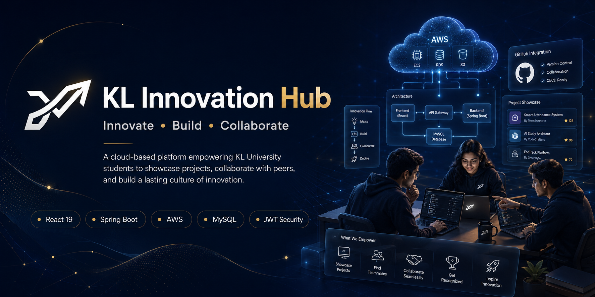

# KL Innovation Hub

### Building a Culture of Innovation at KL University

*A cloud-based student innovation platform that enables KL University students to showcase projects, collaborate with peers, build technical portfolios, and foster innovation beyond the classroom.*

<p>
  <a href="https://klinnovationhub.app">
      
  </a>

  <a href="https://github.com/PraveenReddy-06/KlInnovationHub">
    
  </a>
</p>

<p>
  
  
  
  
  
  
  
</p>

<p>
  
  
  
  
</p>

</div>

---

## 🌐 Live Website

**Live Application:** https://klinnovationhub.app

**GitHub Repository:** https://github.com/PraveenReddy-06/KlInnovationHub

**LinkedIn:** https://www.linkedin.com/in/praveen-maramreddy/

**Email:** praveenmaramreddy2028@gmail.com

---

# About The Project

Every semester, hundreds of innovative student projects are built across universities. Unfortunately, many of these projects disappear once evaluations are complete, receiving little recognition and leaving future students unaware of the ideas, solutions, and innovations created by their peers.

**KL Innovation Hub** was created to solve this problem.

It is a cloud-based innovation platform designed specifically for **KL University** students to discover projects, showcase their work, collaborate with peers, build technical portfolios, and create a lasting ecosystem of innovation beyond classroom submissions.

Instead of projects existing only for grades, KL Innovation Hub encourages students to build meaningful solutions, gain recognition across campus, and inspire future innovators.

---

# Vision

> **To build a collaborative ecosystem where innovation is visible, collaboration is effortless, and every student project has the opportunity to inspire others.**

---

# Why KL Innovation Hub?

Most existing platforms solve only one part of the problem.

| Platform | Limitation |
|-----------|------------|
| GitHub | Excellent for code, but not designed for discovering university innovations or connecting with campus collaborators. |
| LinkedIn | Professional networking platform, but lacks project-centric collaboration among students. |
| Devpost | Focused mainly on hackathons and competitions rather than continuous campus innovation. |

**KL Innovation Hub combines the strengths of these platforms into one centralized ecosystem designed specifically for KL University students.**

Students can:

- Showcase their projects
- Discover innovations across campus
- Build technical portfolios
- Form project teams
- Collaborate with peers
- Gain recognition
- Inspire future students

---

# Key Highlights

- Built completely from scratch
- Fully deployed on AWS Cloud
- JWT-based secure authentication
- OTP email verification
- Team collaboration system
- Project likes & engagement
- Real-time notification system
- Activity feed
- Leaderboard
- Student profiles
- Fully responsive UI
- Modern React + Spring Boot architecture
- SEO optimized
- Google Analytics integration

---

# Project at a Glance

| Metric | Value |
|---------|------:|
| Frontend | React 19 + Vite 8 |
| Backend | Spring Boot 3.5.16 |
| Programming Language | Java 17 |
| Database | MySQL (AWS RDS) |
| Cloud Provider | AWS |
| Database Tables | 12 |
| Controllers | 14+ |
| DTOs | 15+ |
| React Pages | 12+ |
| Authentication | JWT + OTP |
| Deployment | AWS Amplify + Elastic Beanstalk |

---

# Table of Contents

- About the Project
- Features
- Tech Stack
- System Architecture
- Application Workflow
- Project Structure
- Getting Started
- Environment Variables
- Deployment
- Security
- Analytics & SEO
- Screenshots
- Roadmap
- Current Limitations
- Contributing
- Contact
- Acknowledgements

---
# 📸 Platform Preview

| Dashboard | Explore Projects |
|-----------|------------------|
| 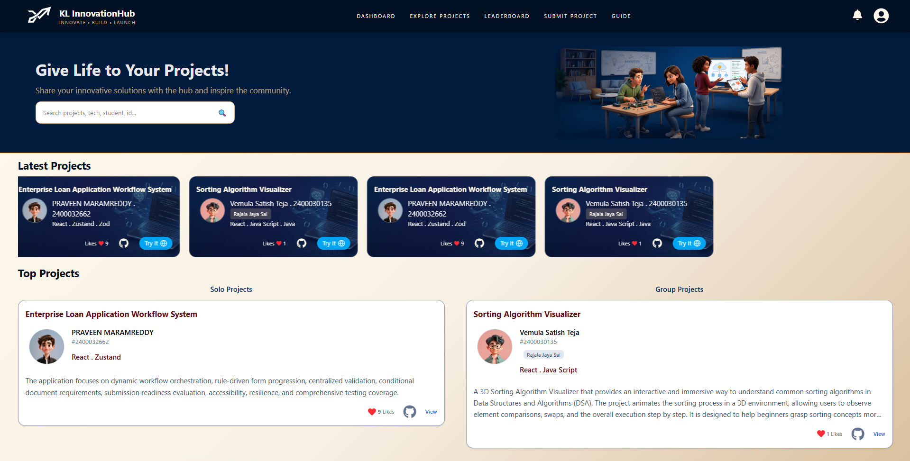 | 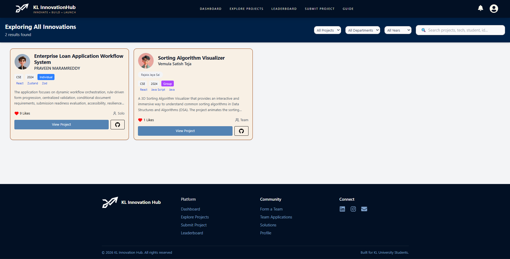 |

| Collaboration Hub | Student Profile |
|-------------------|-----------------|
| 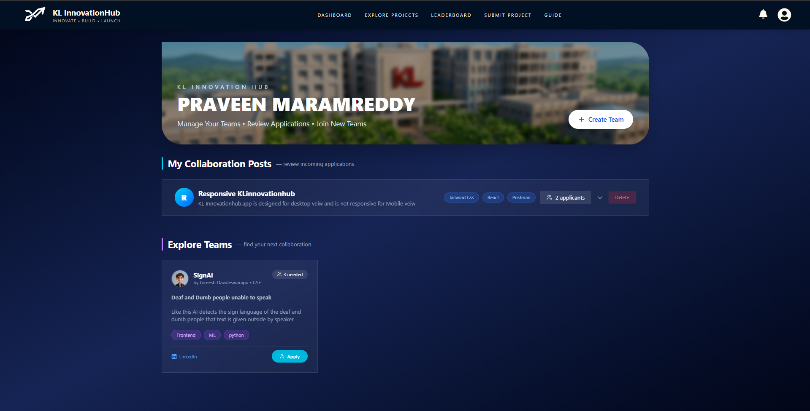 | 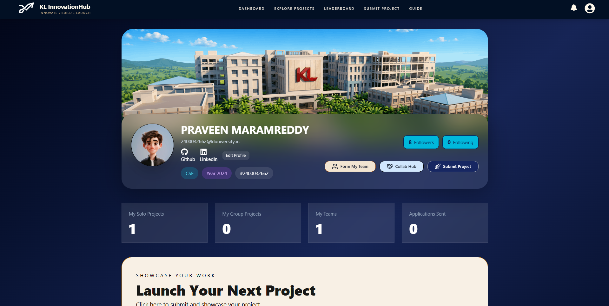 |

| Notifications | Leaderboard |
|---------------|-------------|
| 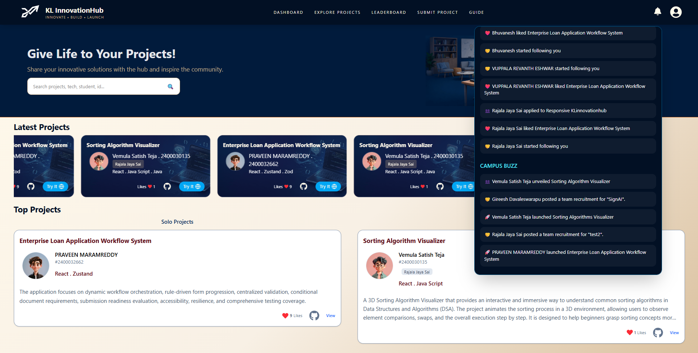 | 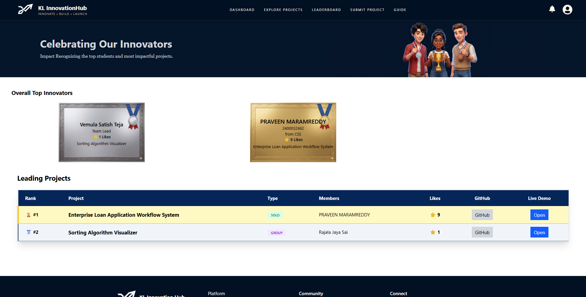 |

---

# Features

KL Innovation Hub is more than a project showcase platform. It provides a complete ecosystem that enables students to build, collaborate, and gain recognition for their technical work.

---

## Authentication & Security

Secure authentication is the foundation of the platform. Every account is protected using industry-standard security practices to ensure safe access and user data protection.

### Features

- JWT-based Authentication
- Email OTP Verification
- Forgot Password with OTP
- BCrypt Password Encryption
- Login Rate Limiting
- Protected API Endpoints
- Backend Input Validation
- Secure CORS Configuration
- Environment Variable Based Configuration
- Stateless Authentication

---

## Student Profiles

Every student has a personalized profile that acts as their technical portfolio within the university.

### Students can

- View their personal profile
- Upload profile information
- Add GitHub profile
- Add LinkedIn profile
- Add portfolio or personal website
- Showcase published projects
- View followers & following
- Track project statistics
- Build a visible campus presence

---

## Project Showcase

Students can publish projects with detailed information, making innovation discoverable across the university.

### Each project supports

- Project Title
- Description
- Tech Stack
- GitHub Repository
- Live Demo URL
- Images
- Tags
- Author Details
- Like System
- Search Visibility

---

## Group Projects

Innovation is rarely built alone.

KL Innovation Hub provides first-class support for collaborative student projects.

### Features

- Create Team Projects
- Multiple Team Members
- Shared Project Ownership
- Team Visibility
- Group Project Likes
- Collaboration Support

---

## Team Formation & Collaboration

Finding the right teammates is often difficult.

The platform simplifies collaboration by allowing students to discover projects and request to join teams.

### Collaboration Features

- Form New Teams
- Collaboration Requests
- Team Applications
- Application Management
- Request Approval Workflow

---

## Social Engagement

Learning becomes more engaging when innovation is visible.

Students can interact with each other's work and build meaningful connections.

### Available Features

- Like Projects
- Like Group Projects
- Follow Students
- Followers & Following Lists
- Student Discovery

---

## Notifications & Activity Feed

The platform keeps students informed about interactions and recent campus activities.

### Notification System

- Follow Notifications
- Like Notifications
- Collaboration Updates
- Team Activities

### Activity Feed

- Recent Platform Activities
- Community Updates
- Student Engagement Timeline

---

## Leaderboard

Healthy competition encourages innovation.

The leaderboard highlights active students and outstanding projects within the community.

### Highlights

- Student Rankings
- Top Projects
- Recognition System
- Campus Visibility

---

## Dashboard

A personalized dashboard provides quick insights into user activity.

Students can monitor

- Total Projects
- Likes Received
- Followers
- Following
- Team Projects
- Platform Statistics
- Recent Activities

---

## User Guide

New users can quickly understand how the platform works through a dedicated guide section.

The guide introduces:

- Platform Overview
- Navigation
- Feature Walkthrough
- Collaboration Process
- Best Practices

---

# Platform Modules

| Module | Description |
|---------|-------------|
| Authentication | Secure login, registration, OTP verification, JWT authentication |
| Dashboard | Personalized overview and platform insights |
| Student Profiles | Public student portfolio and social links |
| Project Showcase | Publish and explore individual projects |
| Group Projects | Collaborative team-based project management |
| Team Formation | Discover teammates and manage collaboration |
| Leaderboard | Student recognition and rankings |
| Notifications | In-app notification system |
| Activity Feed | Community-wide activity tracking |
| Follow System | Build connections across the university |
| Search & Discovery | Easily discover projects and students |
| Guide | Onboarding and platform walkthrough |

---

# Real-World Engineering Highlights

This project was built to simulate many concepts commonly found in production-grade applications.

### Security

- JWT Authentication
- BCrypt Password Hashing
- Email OTP Verification
- Login Rate Limiting
- Secure Backend Validation
- Protected REST APIs

### Cloud Infrastructure

- AWS Amplify Hosting
- AWS Elastic Beanstalk Deployment
- AWS RDS Database
- AWS Security Groups
- HTTPS with SSL Certificate
- Custom Domain Integration

### User Experience

- Responsive Design
- Scroll Animations
- Interactive UI Components
- Toast Notifications
- Fast Client-side Routing
- Optimized API Communication

### Discoverability

- Google Analytics 4
- Google Search Console
- robots.txt
- sitemap.xml
- SEO Metadata

---

# Why This Project Stands Out

KL Innovation Hub was not developed after mastering full-stack development—it was developed while learning it.

Every major component, from React and Spring Boot to JWT authentication, cloud deployment, and AWS networking, was researched, implemented, tested, and refined throughout the development journey.

Many modules were rewritten as new concepts were learned, making this repository not only the final product but also a reflection of continuous learning, problem-solving, and engineering growth.

Rather than relying on ready-made templates or low-code solutions, the platform was designed and built from scratch with the goal of solving a real problem faced by students at KL University.

This project represents both a technical achievement and a personal learning journey.

---

# 🛠️ Technology Stack

KL Innovation Hub is built using a modern full-stack architecture with a strong emphasis on scalability, security, maintainability, and cloud deployment.

---

## Frontend

| Technology | Purpose |
|------------|---------|
| **React 19** | Component-based UI development |
| **Vite 8** | Lightning-fast development server and optimized production builds |
| **Tailwind CSS 4** | Utility-first responsive UI styling |
| **React Router DOM 7** | Client-side routing and navigation |
| **Axios** | Secure communication with backend REST APIs |
| **React Hot Toast** | User-friendly toast notifications |
| **React Icons** | Consistent icon library |
| **Lucide React** | Modern UI icons |
| **Swiper** | Interactive carousels |
| **AOS** | Smooth scroll-based animations |
| **React CountUp** | Animated dashboard statistics |
| **React Flow** | Interactive flow-based visualizations |

---

## Backend

| Technology | Purpose |
|------------|---------|
| **Java 17** | Primary programming language |
| **Spring Boot 3.5.16** | REST API development |
| **Spring Security** | Authentication & authorization |
| **JWT** | Stateless authentication |
| **Spring Data JPA** | Database abstraction layer |
| **Hibernate** | ORM framework |
| **Spring Mail** | OTP email verification and password reset |
| **Lombok** | Reduces boilerplate code |
| **Maven** | Dependency and build management |

---

## Database

| Technology | Purpose |
|------------|---------|
| **MySQL** | Relational database |
| **AWS RDS** | Managed cloud database service |

---

## Cloud Infrastructure

| AWS Service | Purpose |
|-------------|---------|
| **AWS Amplify** | Frontend hosting with automatic deployments |
| **Elastic Beanstalk** | Spring Boot application hosting |
| **AWS RDS** | Managed MySQL database |
| **AWS Certificate Manager** | SSL certificate management |
| **AWS Security Groups** | Network-level access control |
| **Name.com** | Custom domain management |

---

# System Architecture

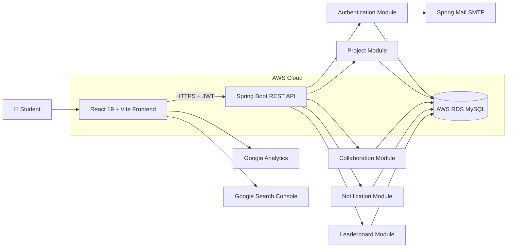

---

# Authentication Flow

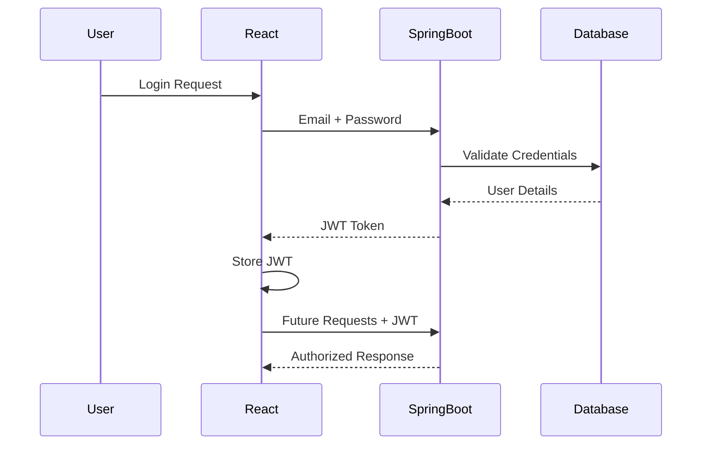

---

# Deployment Architecture

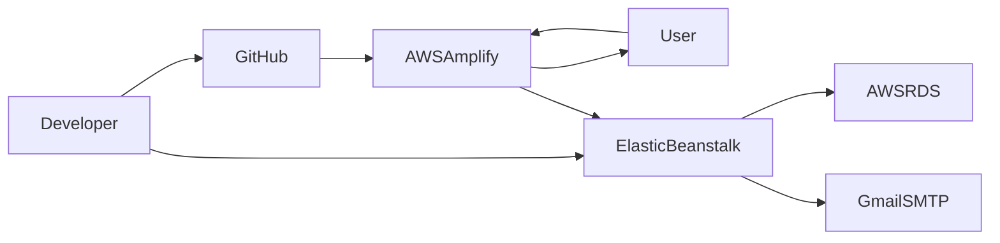

---

# Project Structure

```text
KLInnovationHub
│
├── HubFrontend
│   ├── public
│   ├── src
│   │   ├── Api
│   │   ├── Components
│   │   ├── Data
│   │   ├── Images
│   │   ├── Main
│   │   ├── NavBarPages
│   │   ├── Pages
│   │   ├── Follow
│   │   └── SignUpLogin
│   │
│   ├── package.json
│   └── vite.config.js
│
├── HubBackEnd
│   ├── config
│   ├── controller
│   ├── dto
│   ├── mail
│   ├── model
│   ├── repository
│   ├── security
│   │   └── ratelimit
│   ├── service
│   └── InnovationHubApplication.java
│
└── README.md
```

---

# Backend Architecture

The backend follows a layered architecture to promote separation of concerns and maintainability.

```text
Client Request
      │
      ▼
Controller Layer
      │
      ▼
Service Layer
      │
      ▼
Repository Layer
      │
      ▼
MySQL Database
```

Each layer has a clearly defined responsibility:

| Layer | Responsibility |
|--------|---------------|
| **Controller** | Handles HTTP requests and responses |
| **DTO** | Transfers validated data between client and server |
| **Service** | Contains business logic |
| **Repository** | Database interaction using Spring Data JPA |
| **Model** | Entity mapping to database tables |
| **Security** | JWT authentication, authorization, rate limiting |
| **Configuration** | Spring Security, CORS, password encoding |

---

# Why These Technologies?

Every major technology in this project was selected for a specific reason.

| Technology | Why It Was Chosen |
|------------|-------------------|
| **React** | Modular component architecture and excellent ecosystem |
| **Vite** | Faster builds and improved developer experience |
| **Tailwind CSS** | Rapid UI development with responsive utilities |
| **Spring Boot** | Robust, production-ready backend framework |
| **JWT** | Stateless authentication suitable for REST APIs |
| **AWS Amplify** | Automatic frontend deployments directly from GitHub |
| **Elastic Beanstalk** | Simplifies Spring Boot deployment without managing servers |
| **AWS RDS** | Reliable, managed relational database service |
| **Spring Mail** | Seamless OTP verification through SMTP |
| **Axios** | Simplified and centralized API communication |
| **MySQL** | Reliable relational database with strong Spring ecosystem support |

---

# Project Scale

| Component | Count |
|-----------|------:|
| React Pages | 12+ |
| Backend Controllers | 14+ |
| DTOs | 15+ |
| Database Tables | 12 |
| Service Classes | 12+ |
| Repository Classes | 10+ |
| REST APIs | 35+ |
| Cloud Services | 6 |

---

# Engineering Philosophy

Throughout development, the focus was not only on implementing features but also on building software that follows good engineering practices.

Core principles included:

- Separation of concerns
- Secure-by-default architecture
- Responsive user experience
- Clean project organization
- Environment-based configuration
- Cloud-native deployment
- Continuous improvement through iterative development

The result is a platform that balances functionality, maintainability, and real-world deployment practices while remaining approachable for future enhancements.

---

# Getting Started

Follow the steps below to set up **KL Innovation Hub** on your local machine for development and testing.

---

# Prerequisites

Ensure the following software is installed before starting.

| Software | Version |
|-----------|---------|
| Java | 17 or later |
| Maven | Latest |
| Node.js | 20+ Recommended |
| npm | Latest |
| MySQL | 8.0+ |
| Git | Latest |

---

# Clone the Repository

```bash
git clone https://github.com/PraveenReddy-06/KlInnovationHub.git

cd KlInnovationHub
```

---

# Frontend Setup

Navigate to the frontend project.

```bash
cd HubFrontend
```

Install dependencies.

```bash
npm install
```

Create your environment file.

```text
.env
```

Example

```env
VITE_API_BASE_URL=http://localhost:8080
```

Start the development server.

```bash
npm run dev
```

Frontend runs on

```
http://localhost:5173
```

---

# Backend Setup

Navigate to the backend.

```bash
cd HubBackEnd
```

Install Maven dependencies.

```bash
mvn clean install
```

or

```bash
./mvnw clean install
```

Run the Spring Boot application.

```bash
mvn spring-boot:run
```

or

```bash
./mvnw spring-boot:run
```

Backend runs on

```
http://localhost:8080
```

---

# Database Configuration

Create a MySQL database.

```sql
CREATE DATABASE InnovationHub;
```

Update your environment variables.

Example

```env
DB_URL=jdbc:mysql://localhost:3306/InnovationHub

DB_USERNAME=your_username

DB_PASSWORD=your_password
```

---

# Environment Variables

The backend is fully environment-variable driven.

No sensitive credentials are hardcoded into the project.

## Database

```env
DB_URL=

DB_USERNAME=

DB_PASSWORD=
```

---

## JWT

```env
JWT_SECRET=

JWT_EXPIRATION=
```

---

## Mail Configuration

```env
MAIL_USERNAME=

MAIL_PASSWORD=
```

---

## Frontend

```env
VITE_API_BASE_URL=
```

---

# Security Features

Security was considered from the beginning of development.

### Authentication

- JWT-based Authentication
- Stateless Sessions
- Protected REST APIs

---

### Password Protection

- BCrypt Password Hashing
- Passwords are never stored in plain text

---

### Account Verification

- Email OTP Verification
- Password Reset OTP
- Secure Verification Flow

---

### Login Protection

A custom login rate limiter helps reduce brute-force attacks by temporarily restricting repeated failed login attempts.

---

### Backend Validation

The backend validates incoming requests instead of relying solely on frontend validation.

Examples include

- URL validation
- Input validation
- Authentication checks
- Authorization checks

---

### Network Security

AWS Security Groups restrict database access, allowing only authorized services to communicate with the database.

---

### Configuration Security

Sensitive configuration is managed using environment variables.

Examples include

- Database credentials
- JWT secret
- Mail credentials

This prevents confidential information from being committed to source control.

---

# Deployment

The application is deployed entirely on AWS.

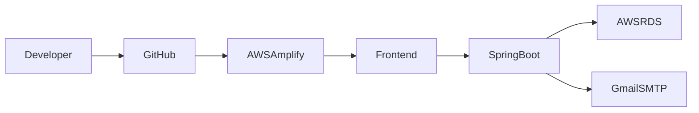

---

## Frontend

Hosted on

- AWS Amplify

Features

- Automatic deployment
- Production builds
- HTTPS
- GitHub integration

---

## Backend

Hosted on

- AWS Elastic Beanstalk

Features

- Managed Spring Boot deployment
- Automatic application management
- Easy updates
- Environment variable configuration

---

## Database

Hosted on

- AWS RDS MySQL

Benefits

- Managed backups
- Reliability
- Scalability
- Secure networking

---

## Domain

Custom Domain

```
klinnovationhub.app
```

Configured using

- name.com
- AWS Certificate Manager

HTTPS is enabled using SSL certificates.

---

# Analytics & SEO

To improve discoverability and understand user engagement, the platform includes several SEO and analytics integrations.

## Google Analytics 4

Tracks

- Visitor count
- User sessions
- Popular pages
- Engagement metrics

---

## Google Search Console

Used for

- Search indexing
- Search performance
- Crawl monitoring

---

## SEO Optimizations

Implemented

- robots.txt
- sitemap.xml
- Metadata
- Semantic HTML
- Responsive design

---

# API Overview

The backend exposes REST APIs organized into dedicated modules.

| Module | Responsibility |
|---------|---------------|
| Authentication | Login, Signup, OTP, Password Reset |
| Student | Student Profile Management |
| Projects | Individual Projects |
| Group Projects | Team-based Projects |
| Collaboration | Team Formation |
| Followers | Social Connections |
| Notifications | User Notifications |
| Activity | Platform Activity Feed |
| Leaderboard | Rankings |
| Likes | Project Engagement |

---

# Database Overview

The platform currently uses **12 relational tables**.

```
student

user_sign_up

project

group_project

group_project_students

project_likes

group_project_likes

followers

collaboration

collab_application

notification

activity
```

The database design separates authentication, user profiles, collaboration, notifications, and engagement features into independent tables to improve maintainability and normalization.

---

# Performance Considerations

Several engineering decisions were made to improve performance and maintainability.

- Optimized API communication using Axios
- Stateless JWT authentication
- Component-based React architecture
- Environment-based configuration
- Modular Spring Boot services
- Responsive Tailwind UI
- Cloud-hosted infrastructure
- Production-ready deployment pipeline

---

# Challenges & Engineering Journey

KL Innovation Hub was not built after mastering full-stack development—it was built **while learning it**.

Every major concept, from React components and Spring Boot APIs to JWT authentication, AWS deployment, and cloud networking, was researched, implemented, tested, and often rewritten as my understanding evolved.

This repository represents not only the final application but also the engineering journey behind it.

---

## Major Challenges

### Implementing JWT Authentication

JWT authentication was one of the most challenging parts of the project because it was never covered in my university coursework.

Building a secure authentication system required understanding:

- Stateless authentication
- Token generation and validation
- Spring Security filter chains
- Protected routes
- Request authorization
- Secure password storage using BCrypt

Implementing these concepts significantly improved my understanding of backend security and modern web application architecture.

---

### ☁️ Deploying to AWS

Deploying a full-stack application to AWS introduced a completely different set of challenges compared to local development.

The project was deployed using:

- AWS Amplify
- AWS Elastic Beanstalk
- AWS RDS
- AWS Security Groups
- AWS Certificate Manager

Learning how these services interact provided valuable hands-on experience with real cloud infrastructure.

---

### Solving HTTPS Communication Issues

After deployment, the frontend was served over **HTTPS**, while the backend was still accessible only through **HTTP**.

Modern browsers block this type of mixed-content communication for security reasons, preventing the application from functioning correctly.

Initially, I explored using CloudFront to solve the issue and even contacted AWS Support. However, my request could not be accommodated under the limitations of my account.

Rather than treating this as a blocker, I explored alternative solutions over several days. Through the GitHub Student Developer Pack, I discovered a discounted custom domain from **Name.com**. I registered the domain, configured **AWS Certificate Manager**, enabled HTTPS for the backend, and completed the deployment successfully.

This experience taught me that software engineering often involves understanding infrastructure and solving deployment challenges—not just writing code.

---

### Continuous Refactoring

Because the project was developed alongside my full-stack learning journey, many components were redesigned and rewritten as I gained deeper knowledge.

Instead of accepting the first working solution, I continuously improved the codebase by applying better practices related to:

- Project architecture
- Component organization
- Backend design
- Security
- Performance
- Cloud deployment

This iterative approach significantly improved the overall quality and maintainability of the platform.

---

# Lessons Learned

Developing KL Innovation Hub strengthened both my technical knowledge and engineering mindset.

Some of the key lessons include:

- Designing scalable full-stack architectures
- Building secure REST APIs
- Implementing JWT authentication with Spring Security
- Deploying production-ready applications on AWS
- Working with managed cloud databases
- Configuring HTTPS and SSL certificates
- Managing environment variables securely
- Improving user experience through responsive UI design
- Building applications with maintainability in mind
- Solving real-world deployment and infrastructure issues

---

# Roadmap

KL Innovation Hub will continue evolving with the goal of becoming the primary innovation platform for students at KL University.

### Short-Term Goals

- Reach **1,000+ active student users**
- Improve overall user experience
- Expand project discovery features
- Enhance collaboration workflows
- Improve search and filtering capabilities

---

### Future Enhancements

- AI-powered project recommendations
- Smart teammate recommendations
- Faculty and mentor profiles
- Organization and club pages
- Internship and opportunity listings
- Project bookmarking
- Advanced analytics dashboard
- Achievement badges
- Enhanced notification preferences
- Progressive Web App (PWA) support

---

### Long-Term Vision

The long-term vision is to build a sustainable ecosystem where students can:

- Showcase innovation
- Discover opportunities
- Build meaningful collaborations
- Learn from peers
- Gain recognition
- Continue improving projects beyond academic evaluations

---

# Current Limitations

At present, KL Innovation Hub is designed specifically for students from the following departments at KL University:

- Computer Science Engineering (CSE)
- Electronics and Communication Engineering (ECE)
- Computer Science and Information Technology (CSIT)

Support for additional departments is planned for future releases as the platform grows.

---

# Contributing

Contributions, suggestions, and feedback are always welcome.

If you have ideas to improve KL Innovation Hub:

1. Fork the repository.
2. Create a feature branch.
3. Commit your changes.
4. Open a Pull Request.

Constructive discussions and issue reports are equally appreciated.

---

# Contact

**Developer:** Praveen Maramreddy

**LinkedIn:**  
https://www.linkedin.com/in/praveen-maramreddy/

**Email:**  
praveenmaramreddy2028@gmail.com

**Repository:**  
https://github.com/PraveenReddy-06/KlInnovationHub

---

# Acknowledgements

This project would not have reached its current state without the technologies, communities, and resources that supported its development.

Special thanks to:

- React Community
- Spring Boot Community
- Tailwind CSS
- AWS
- MySQL
- GitHub
- Vite
- Open Source Contributors

Their tools and documentation made it possible to transform an idea into a production-ready application.

---

# Support the Project

If you found this project interesting or inspiring:

-  Star the repository
-  Fork the project
-  Share your feedback
-  Connect with me on LinkedIn

Every star, suggestion, and contribution helps the project continue to grow.

---

<div align="center">

## Thank You for Visiting KL Innovation Hub ❤️

*"Innovation grows when ideas are shared, collaboration is encouraged, and students are empowered to build solutions that create real impact."*

**Built with dedication by Praveen Maramreddy**

</div>
