<div align="center">


# KL Innovation Hub

### Building a Culture of Innovation at KL University

*A cloud-based student innovation platform that enables KL University students to discover projects, showcase their work, collaborate with peers, build technical portfolios, and connect with faculty reviewers for project guidance and evaluation.*

<p>
  <a href="https://klinnovationhub.app">
    
  </a>

  <a href="https://github.com/PraveenReddy-06/KlInnovationHub">
    
  </a>
</p>

<p>
  
  
  
  
  
  
  
</p>

<p>
  
  
  
  
  
</p>

</div>

---

# 🌐 Live Website

**Live Application:** https://klinnovationhub.app

**GitHub Repository:** https://github.com/PraveenReddy-06/KlInnovationHub

**Email:** praveenmaramreddy2028@gmail.com

**LinkedIn:** https://www.linkedin.com/in/praveen-maramreddy/

**Instagram:** https://www.instagram.com/kl_innovationhub/?hl=en

---

# About The Project

Student projects are often created for academic evaluation and then become difficult for others to discover, learn from, or build upon.

Another important gap is the absence of a centralized workflow where students can receive project guidance and structured review from faculty.

**KL Innovation Hub** was created to address both problems.

It is a cloud-based innovation platform designed specifically for **KL University** students to discover projects, showcase their work, form teams, collaborate with peers, build technical portfolios, and get guidance from faculty through a dedicated project-review workflow.

Instead of projects existing only for grades, KL Innovation Hub helps turn academic project work into a visible campus innovation ecosystem where students can learn from one another, receive feedback, improve their work, and gain recognition.

---

# Problem Statement

Many student projects are evaluated only within the immediate academic process.

Once an evaluation is completed, the project may no longer have a structured path for visibility, collaboration, improvement, or future learning.

The problem is not only project visibility.

Students can also lack an accessible and centralized way to:

- Discover innovative projects created by other students
- Find teammates for future projects
- Know the projects of your Juniors and Seniors
- Receive guidance from faculty on project quality and direction
- Recruit Students for you project
- Discuss and share ideas about projects
- Compete with other Innovators across the platform

KL Innovation Hub addresses these gaps through a single student-focused innovation and project-review ecosystem.

---

# Vision

> **To build a collaborative university ecosystem where innovation is visible, collaboration is effortless, faculty guidance is accessible, and every student project has the opportunity to improve and inspire others.**

---

# Why KL Innovation Hub?

Most existing platforms solve only one part of the problem.

| Platform | Limitation |
|-----------|------------|
| GitHub | Excellent for code, but not designed for discovering university innovations, campus collaboration, or faculty project review. |
| LinkedIn | Professional networking platform, but lacks a project-centric university collaboration and review workflow. |
| Devpost | Focused mainly on hackathons and competitions rather than continuous campus innovation and project development. |

**KL Innovation Hub combines project discovery, collaboration, student portfolios, social engagement, and faculty project review into one centralized ecosystem for KL University.**

Students can:

- Showcase projects
- Discover innovations across campus
- Build technical portfolios
- Form project teams
- Collaborate with peers
- Get guidance from faculty reviewers
- Join Discussions
- Receive project feedback
- Gain recognition
- Inspire future students

---

# Key Highlights

- Built completely from scratch
- Fully deployed on AWS Cloud
- Role-based access for Students, Project Reviewers, and Administrators
- JWT-based secure authentication
- OTP email verification
- Student and faculty/reviewer onboarding flows
- Faculty reviewer application and admin approval workflow
- Structured review workflow for solo and group projects
- Approve or reject projects with reviewer feedback
- Reviewer review history and project decision tracking
- Email and in-app notifications for project review decisions
- Team collaboration system
- Project likes & engagement
- Follow system
- Activity feed
- Leaderboard
- Student profiles
- Fully responsive UI
- Modern React + Spring Boot architecture
- SEO optimized
- Google Analytics integration

---

# Project at a Glance

| Metric | Current Implementation |
|--------|-----------------------:|
| Frontend | React 19 + Vite 8 |
| Backend | Spring Boot 3.5.16 |
| Programming Language | Java 17 |
| Database | MySQL |
| Cloud Provider | AWS |
| User Roles | 3 — Student, Reviewer, Admin |
| Database Tables | 19+ |
| React Pages | 21+ |
| Rest Api | 50+ |
| Controllers | 21+ |
| DTOs | 26+ |
| Model | 19+ |
| Service | 19+ |
| Authentication | JWT + OTP |
| Deployment | AWS Amplify + Elastic Beanstalk |
| Database | AWS RDS MySQL |

> These values represent the current `feature/project-discussion` implementation and may change as the platform evolves.

---

# Table of Contents

- [About The Project](#about-the-project)
- [Problem Statement](#problem-statement)
- [Vision](#vision)
- [Why KL Innovation Hub?](#why-kl-innovation-hub)
- [Key Highlights](#key-highlights)
- [Project at a Glance](#project-at-a-glance)
- [Features](#features)
- [Roles & Access](#roles--access)
- [Project Review Workflow](#project-review-workflow)
- [Platform Modules](#platform-modules)
- [Technology Stack](#technology-stack)
- [System Architecture](#system-architecture)
- [Authentication & Authorization](#authentication--authorization)
- [Project Structure](#project-structure)
- [Backend Architecture](#backend-architecture)
- [Security](#security)
- [Deployment](#deployment)
- [Getting Started](#getting-started)
- [Environment Variables](#environment-variables)
- [API Overview](#api-overview)
- [Database Overview](#database-overview)
- [Performance Considerations](#performance-considerations)
- [Challenges & Engineering Journey](#challenges--engineering-journey)
- [Roadmap](#roadmap)
- [Current Limitations](#current-limitations)
- [Contributing](#contributing)
- [Contact](#contact)

---

# 📸 Platform Preview

| Dashboard | Explore Projects |
|-----------|------------------|
|  |  |

| Collaboration Hub | Student Profile |
|-------------------|-----------------|
|  |  |

| Leaderboard | Admin Dashboard |
|---------------|-------------|
|  | 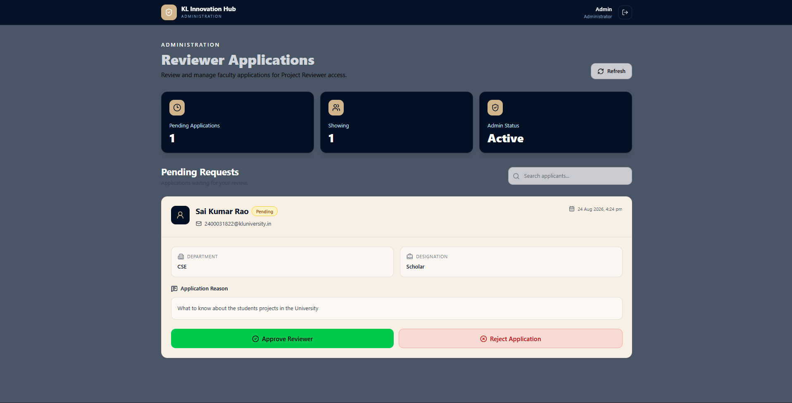 |

| Reviewer Dashboard | Reviewer Profile |
|---------------|-------------|
| 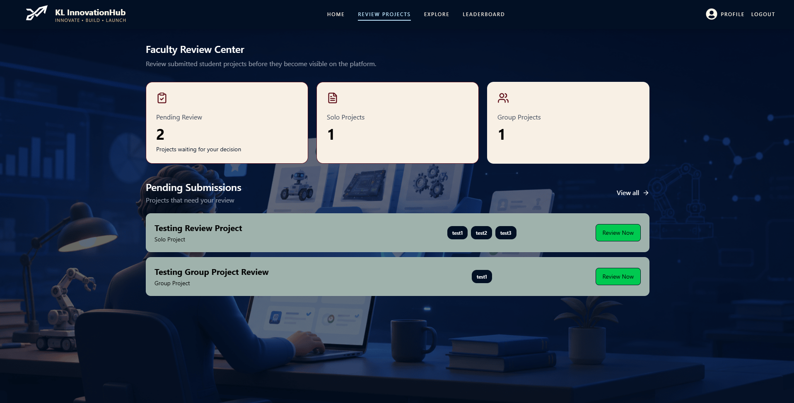 | 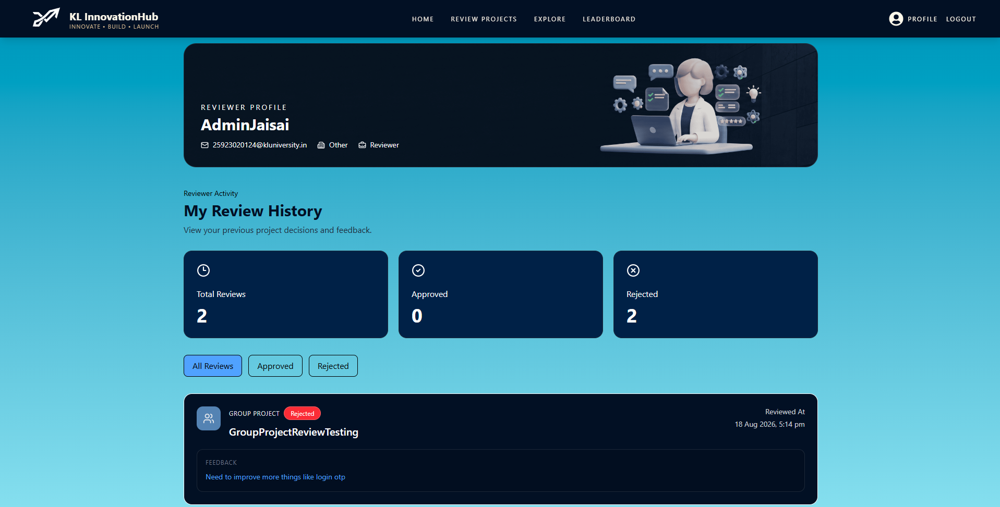 |

| Project Review Page | Discussion Forum |
|---------------|-------------|
| 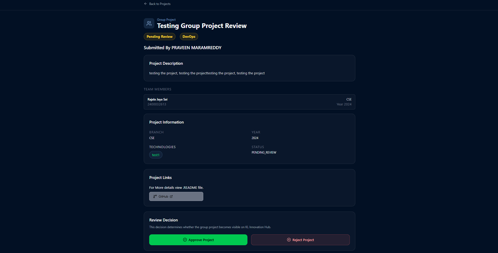 | 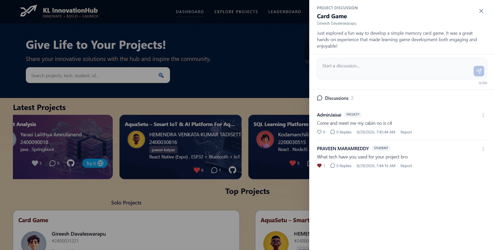 |

---

# Features

KL Innovation Hub provides an ecosystem for students, faculty reviewers, and administrators to support project creation, collaboration, review, improvement, and recognition.

---

## Authentication & Security

Secure authentication is the foundation of the platform.

### Student Authentication

- Student registration
- University email verification through OTP
- Login with JWT authentication
- Forgot password with OTP
- BCrypt password hashing
- Login rate limiting
- Protected API endpoints
- Backend validation
- Secure CORS configuration
- Stateless authentication

### Reviewer Authentication

Faculty members can apply for a Project Reviewer account through a dedicated onboarding flow.

- Reviewer account selection
- University email verification
- OTP verification
- Department capture
- Designation capture
- Reviewer application
- Reviewer approval requirement
- Reviewer forgot-password flow
- JWT-based authentication
- Protected reviewer routes

### Admin Authentication

Administrators have a separate authentication boundary for reviewer-management operations.

- Dedicated admin login
- JWT authentication
- Protected admin routes
- Admin-specific API client
- Reviewer application management

---

# Roles & Access

The platform currently supports three roles.

| Role | Responsibility |
|------|----------------|
| **Student** | Create, submit, discover, collaborate, discuss, and showcase projects |
| **Reviewer** | Review pending projects, provide feedback, discuss, and approve/reject submissions |
| **Admin** | Manage reviewer applications and approve/reject reviewer access |

### Student

Students can:

- Create projects
- Submit solo projects
- Submit group projects
- Explore approved projects
- Involve in a Project discussion
- Like projects
- Follow students
- Create teams
- Join teams
- Manage collaboration requests
- View notifications
- View activity
- Build their profile
- View leaderboard rankings

### Reviewer

Approved faculty reviewers can:

- Access reviewer dashboard
- View pending projects
- Review solo projects
- Review group projects
- Involve in a project discussion
- View project details
- View technologies
- Open GitHub links
- Open live project links
- Approve projects
- Reject projects
- Provide rejection feedback
- View review history

### Admin

Administrators can:

- Login through the admin portal
- View pending reviewer applications
- Search reviewer applications
- Review faculty information
- Approve reviewer applications
- Reject reviewer applications
- Manage reviewer access

---

# Student Profiles

Every student has a personalized profile that acts as their technical portfolio within the university.

### Students can

- View their personal profile
- Add GitHub profile
- Add LinkedIn profile
- Add portfolio or personal website
- Showcase approved projects
- View followers
- View following
- Track project statistics
- Build a visible campus presence

---

# Project Showcase

Students can publish projects with detailed information.

### Project information includes

- Project title
- Description
- Project category
- Technologies
- GitHub repository
- Live demo URL
- Comments
- Author information
- Project status
- Engagement information

### Project Visibility

New projects are submitted with:
PENDING_REVIEW

# Group Projects

Innovation is rarely built alone.

KL Innovation Hub provides support for collaborative student projects.

### Features

- Create team projects
- Multiple team members
- Team lead
- Shared project information
- Team visibility
- Group project likes
- Collaboration support
- Faculty review for group submissions

---

# Team Formation & Collaboration

Finding the right teammates is often difficult.

The platform allows students to discover projects, form teams, and manage collaboration requests.

### Features

- Form new teams
- Add team members
- Collaboration requests
- Team applications
- Application management
- Request approval workflow

---

# Social Engagement

Students can interact with projects and build connections across the university.

### Available Features

- Comment On other projects
- Like projects
- Like group projects
- Follow students
- Followers & following
- Student discovery
- Project engagement
- Leaderboard participation

---

# Notifications & Activity Feed

The platform keeps students informed about important project and community activity.

### Notifications

- Follow notifications
- Like notifications
- Collaboration updates
- Project submission updates
- Project approval notifications
- Project rejection notifications
- Review-related updates

### Activity Feed

- Recent platform activities
- Project creation activities
- Group project activities
- Community engagement timeline

---

# Leaderboard

Healthy competition encourages innovation.

The leaderboard highlights active students and outstanding approved projects.

### Highlights

- Student rankings
- Top projects
- Recognition
- Campus visibility

---

# Dashboard

The student dashboard provides a personalized overview of activity.

Students can monitor:

- Total projects
- Likes received
- Followers
- Following
- Team projects
- Platform statistics
- Recent activities

---

# Explore Projects

Students can discover approved projects across the university.

### Discovery Features

- Solo projects
- Group projects
- Project search
- Project filtering
- Branch filtering
- Year filtering
- Technology information
- GitHub links
- Live project links

Only approved projects are exposed through the public project discovery flow.

---

# User Guide

The platform includes a dedicated guide section for new users.

The guide introduces:

- Platform overview
- Navigation
- Feature walkthrough
- Collaboration process
- Best practices

---

# Faculty Project Review

One of the major additions in the new version is the **Faculty Project Reviewer system**.

The reviewer workflow provides students with a structured way to receive faculty evaluation and feedback on their projects.

Reviewer applications contain information such as:

- Name
- Email
- Department
- Designation
- Reason for becoming a reviewer
- Application status
- Created time
- Reviewed time

---

# Reviewer Workspace

Approved reviewers have a dedicated reviewer experience.

### Reviewer pages include

- Reviewer Dashboard
- Pending Projects
- Solo Project Review
- Group Project Review
- Review History
- Reviewer Profile
- Reviewer Navigation

---

# Reviewing Projects

Reviewers can inspect pending project submissions.

### Reviewers can view

- Project name
- Description
- Team lead
- Team members
- Branch
- Year
- Technologies
- Project status
- GitHub repository
- Live project

---


# Review History

Reviewer decisions are stored and displayed through a dedicated history page.

The history includes:

- Project name
- Project type
- Decision
- Feedback
- Review timestamp
- Solo/group classification

Reviewers can also see summary information such as:

- Total reviews
- Approved projects
- Rejected projects

---

# Admin Reviewer Management

Administrators manage faculty reviewer applications.

### Admin Pages

- Admin Login
- Admin Dashboard

### Admin capabilities

- View pending reviewer applications
- Search applications
- View faculty information
- Approve reviewer applications
- Reject reviewer applications
- Control reviewer access

Reviewer accounts cannot directly access the reviewer platform until the application has been approved.

---

# Project Review Workflow

The project lifecycle now includes faculty review.

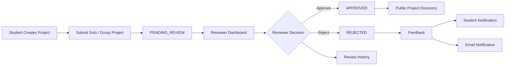

---

# Reviewer Application Workflow

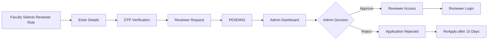

---

# Platform Modules

| Module | Description |
|--------|-------------|
| Authentication | Login, registration, OTP, password reset, JWT authentication |
| Student Profiles | Student portfolio and social information |
| Dashboard | Personalized student statistics |
| Project Showcase | Solo project submission and discovery |
| Group Projects | Team-based project management |
| Team Formation | Collaboration and team applications |
| Leaderboard | Rankings and recognition |
| Notifications | In-app notifications |
| Activity Feed | Community activity |
| Follow System | Student connections |
| Search & Discovery | Project and student discovery |
| Guide | Platform onboarding |
| Reviewer Onboarding | Faculty reviewer registration |
| Reviewer Authentication | Reviewer login and password recovery |
| Reviewer Workspace | Pending project review |
| Review History | Review decisions and feedback |
| Admin Authentication | Admin login |
| Admin Reviewer Management | Reviewer approval and rejection |

---

# Technology Stack

KL Innovation Hub uses a modern full-stack architecture.

---

## Frontend

| Technology | Purpose |
|------------|---------|
| **React 19** | Component-based UI development |
| **Vite 8** | Development server and production builds |
| **Tailwind CSS 4** | Responsive UI styling |
| **React Router DOM 7** | Client-side routing |
| **Axios** | REST API communication |
| **React Hot Toast** | Toast notifications |
| **React Icons** | Icon library |
| **Lucide React** | Modern icons |
| **Swiper** | Interactive carousels |
| **AOS** | Scroll animations |
| **React CountUp** | Animated statistics |
| **React Flow** | Flow-based visualizations |

---

## Backend

| Technology | Purpose |
|------------|---------|
| **Java 17** | Primary programming language |
| **Spring Boot 3.5.16** | REST API development |
| **Spring Security** | Authentication and authorization |
| **JWT** | Stateless authentication |
| **Spring Data JPA** | Database abstraction |
| **Hibernate** | ORM |
| **Spring Mail** | OTP and email communication |
| **Lombok** | Boilerplate reduction |
| **Maven** | Dependency and build management |

---

## Database

| Technology | Purpose |
|------------|---------|
| **MySQL** | Relational database |
| **AWS RDS** | Managed MySQL database |

---

## Cloud Infrastructure

| AWS Service | Purpose |
|-------------|---------|
| **AWS Amplify** | Frontend hosting |
| **AWS Elastic Beanstalk** | Backend hosting |
| **AWS RDS** | MySQL database |
| **AWS Certificate Manager** | SSL certificate |
| **AWS Security Groups** | Network access control |
| **Name.com** | Custom domain |

---

# System Architecture

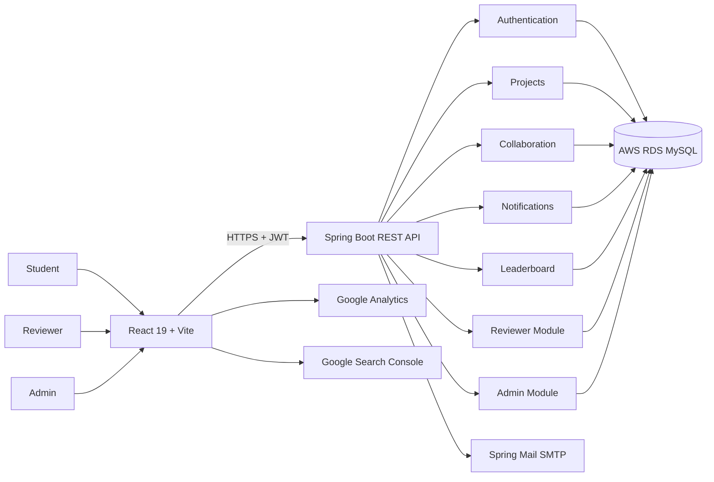

---

# Authentication & Authorization

The application uses JWT-based authentication with role-specific access control.

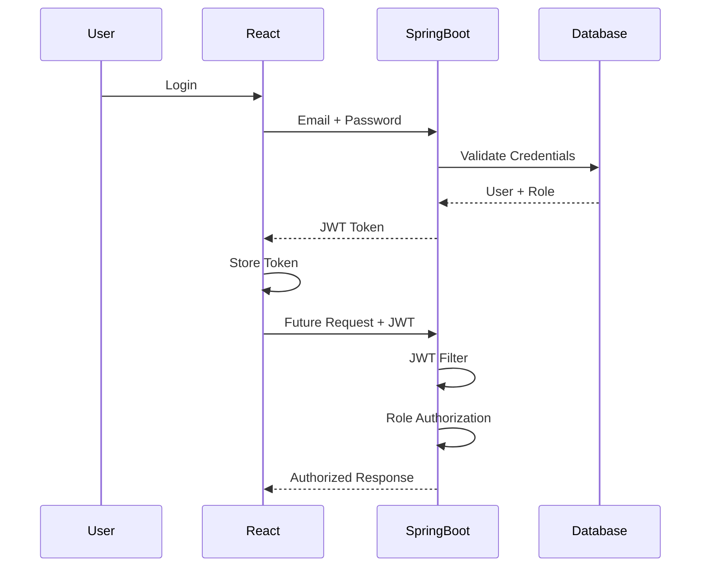
---
---

# Current Project Flow

```text
STUDENT
   │
   ├── Create Account
   │
   ├── Explore Projects
   │
   ├── Form / Join Teams
   │
   └── Submit Project
           │
           ▼
     PENDING_REVIEW
           │
           ▼
      REVIEWER
           │
      ┌────┴────┐
      │         │
      ▼         ▼
  APPROVED   REJECTED
      │         │
      │         ├── Feedback
      │         ├── Notification
      │         └── Email
      │
      ▼
PUBLIC PROJECT DISCOVERY
```

### Faculty Reviewer Flow

```text
FACULTY
   │
   ▼
Reviewer Registration
   │
   ▼
OTP Verification
   │
   ▼
Reviewer Request
   │
   ▼
PENDING
   │
   ▼
ADMIN
   │
   ├── Approve
   │      ↓
   │   REVIEWER ACCESS
   │
   └── Reject
          ↓
      APPLICATION REJECTED
```

---


# Deployment Architecture

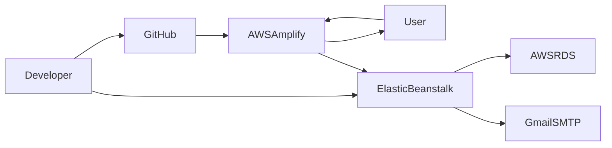

---


### Role authorization

```text
ROLE_STUDENT
ROLE_REVIEWER
ROLE_ADMIN
```

Reviewer and admin APIs are protected separately.

---

# Project Structure

```text
KLInnovationHub
│
├── HubFrontend
│   ├── public
│   ├── src
│   │   ├── Api
│   │   │   ├── axiosInstance
│   │   │   ├── reviewerAxiosInstance
│   │   │   └── adminAxiosInstance
│   │   │
│   │   ├── Components
│   │   ├── Data
│   │   ├── Images
│   │   ├── Main
│   │   ├── NavBarPages
│   │   ├── Pages
│   │   │
│   │   └── Analytics.jsx
│   │
│   ├── package.json
│   └── vite.config.js
│
├── HubBackEnd
│   ├── config
│   ├── controller
│   ├── dto
│   ├── mail
│   ├── model
│   ├── repository
│   ├── security
│   ├── service
│   └── InnovationHubApplication.java
│
└── README.md
```

---

# Backend Architecture

The backend follows a layered architecture.

```text
Client Request
      │
      ▼
Controller Layer
      │
      ▼
Service Layer
      │
      ▼
Repository Layer
      │
      ▼
MySQL Database
```

# Real-World Engineering Highlights

## Security

- JWT authentication
- BCrypt password hashing
- Email OTP verification
- Login rate limiting
- Role-based authorization
- Protected APIs
- Backend validation
- Secure CORS
- Token Validation

## Cloud Infrastructure

- AWS Amplify
- AWS Elastic Beanstalk
- AWS RDS
- AWS Security Groups
- AWS Certificate Manager
- HTTPS
- Custom domain

## User Experience

- Responsive design
- Interactive components
- Toast notifications
- Client-side routing
- Lazy-loaded pages
- Role-specific interfaces
- Centralized API communication

## Discoverability

- Google Analytics 4
- Google Search Console
- robots.txt
- sitemap.xml
- SEO metadata
- Semantic HTML

---


# Getting Started

Follow the steps below to run KL Innovation Hub locally.

---

# Prerequisites

| Software | Version |
|----------|---------|
| Java | 17+ |
| Maven | Latest |
| Node.js | 20+ recommended |
| npm | Latest |
| MySQL | 8.0+ |
| Git | Latest |

---

# Clone the Repository

```bash
git clone https://github.com/PraveenReddy-06/KlInnovationHub.git

cd KlInnovationHub
```

---

# Frontend Setup

```bash
cd HubFrontend
```

Install dependencies:

```bash
npm install
```

Create:

```text
.env
```

Example:

```env
VITE_API_URL=http://localhost:8080
```

Start the frontend:

```bash
npm run dev
```

Frontend:

```text
http://localhost:5173
```

---

# Backend Setup

Navigate to:

```bash
cd HubBackEnd
```

Install dependencies:

```bash
mvn clean install
```

or:

```bash
./mvnw clean install
```

Run the backend:

```bash
mvn spring-boot:run
```

or:

```bash
./mvnw spring-boot:run
```

Backend:

```text
http://localhost:8080
```

---

# Database Configuration

Create the database:

```sql
CREATE DATABASE InnovationHub;
```

Example configuration:

```env
DB_URL=jdbc:mysql://localhost:3306/InnovationHub
DB_USERNAME=your_username
DB_PASSWORD=your_password
```

---

# Environment Variables

Sensitive credentials should not be committed to GitHub.

## Database

```env
DB_URL=
DB_USERNAME=
DB_PASSWORD=
```

## JWT

```env
JWT_SECRET=
JWT_EXPIRATION=
```

## Mail

```env
MAIL_USERNAME=
MAIL_PASSWORD=
```

## Frontend

```env
VITE_API_URL=
```

---


# Deployment

The application is deployed using AWS.

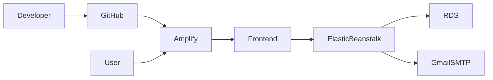

---

# Frontend Deployment

Hosted on:

- AWS Amplify

Features:

- GitHub integration
- Production builds
- HTTPS
- Automatic deployments

---

# Backend Deployment

Hosted on:

- AWS Elastic Beanstalk

Features:

- Spring Boot hosting
- Environment variables
- HTTPS
- Scalable infrastructure

---

# Database Deployment

Hosted on:

- AWS RDS MySQL

Benefits:

- Managed database
- Backups
- Reliability
- Scalability
- Secure networking

---

# Domain

```text
klinnovationhub.app
```

Configured using:

- Name.com
- AWS Certificate Manager

HTTPS is enabled through SSL certificates.

---

# Analytics & SEO

## Google Analytics 4

Tracks:

- Visitors
- Sessions
- Popular pages
- Engagement metrics

## Google Search Console

Used for:

- Search indexing
- Search performance
- Crawl monitoring

## SEO

Implemented:

- robots.txt
- sitemap.xml
- Metadata
- Semantic HTML
- Responsive design

---

# API Overview

The backend exposes REST APIs organized into dedicated modules.

| Module | Responsibility |
|--------|----------------|
| Authentication | Login, signup, OTP, password reset |
| Reviewer Authentication | Reviewer login, OTP, password recovery |
| Admin Authentication | Admin login |
| Student | Student profile operations |
| Projects | Solo project operations |
| Group Projects | Group project operations |
| Collaboration | Team formation |
| Followers | Social connections |
| Notifications | Notifications |
| Activity | Activity feed |
| Leaderboard | Rankings |
| Likes | Project engagement |
| Reviewer Projects | Pending project retrieval |
| Reviewer Review | Approve/reject projects |
| Reviewer History | Review history |
| Admin Reviewers | Reviewer application management |

---

# Database Overview

The platform uses MySQL with separate entities for authentication, students, projects, collaboration, social features, notifications, and project reviews.

### Existing core tables

```text
student

user_sign_up

project

group_project

group_project_students

project_likes

group_project_likes

followers

collaboration

collab_application

notification

activity
```

### Reviewer-related tables

```text
reviewer

reviewer_request

project_review
```

### Project status

```text
PENDING_REVIEW
APPROVED
REJECTED
```

### Reviewer request status

```text
PENDING
APPROVED
REJECTED
```

---


# Performance Considerations

Several engineering decisions improve performance and maintainability.

- Lazy-loaded React pages
- Component-based architecture
- Modular Spring Boot services
- Stateless JWT authentication
- Centralized Axios communication
- Environment-based configuration
- Public APIs return approved projects
- Protected APIs for privileged operations
- Responsive Tailwind UI
- Cloud-hosted infrastructure

---

# Challenges & Engineering Journey

KL Innovation Hub was not built after mastering full-stack development.

It was built **while learning it**.

Every major concept, from React components and Spring Boot APIs to JWT authentication, AWS deployment, cloud networking, and role-based authorization, was researched, implemented, tested, and refined throughout development.

The reviewer feature introduced another architectural challenge by connecting:

```text
Students
   ↓
Project Submission
   ↓
Reviewer
   ↓
Review Decision
   ↓
Feedback
   ↓
Notifications
   ↓
Project Visibility
```

At the same time, faculty access needed to be controlled through an administrator approval workflow.

---

# Major Challenges

## JWT Authentication

JWT authentication required understanding:

- Stateless authentication
- Token generation
- Token validation
- Spring Security filters
- Protected routes
- Authorization
- BCrypt password hashing

---

## Role-Based Access

The platform originally focused primarily on students.

The reviewer feature introduced:

```text
STUDENT
REVIEWER
ADMIN
```

Each role now has its own protected functionality.

This required:

- Spring Security role checks
- JWT handling
- Protected React routes
- Dedicated Axios clients
- Separate reviewer/admin login flows

---

## AWS Deployment

Deploying the full-stack application introduced challenges that do not appear during local development.

The application uses:

- AWS Amplify
- AWS Elastic Beanstalk
- AWS RDS
- AWS Security Groups
- AWS Certificate Manager

---

## HTTPS Communication

During deployment, the frontend was served over HTTPS while the backend initially used HTTP.

Modern browsers block mixed-content requests for security reasons.

The deployment required configuring HTTPS correctly between the frontend, backend, and custom domain.

---

## Continuous Refactoring

The application has continuously evolved as new concepts and requirements were introduced.

The reviewer feature is an example of that evolution:

```text
Student Platform
       ↓
Social Platform
       ↓
Collaboration Platform
       ↓
Multi-Role Platform
       ↓
Faculty Project Review
       ↓
Admin Review Management
```


# Roadmap

Potential future improvements include:

- Reviewer analytics
- Review scoring system
- Detailed review criteria
- Student review feedback history
- Project resubmission workflow
- Advanced admin management
- Richer faculty-student guidance
- Project analytics
- Reviewer performance insights

---

# Current Limitations


At present, KL Innovation Hub is designed specifically for students from the following departments at KL University:

- Computer Science Engineering (CSE)
- Electronics and Communication Engineering (ECE)
- Computer Science and Information Technology (CSIT)

Support for additional departments is planned for future releases as the platform grows.

---

# Contributing

Contributions, suggestions, and issue reports are welcome.

Before submitting changes:

1. Fork the repository
2. Create a feature branch
3. Make your changes
4. Test the affected frontend and backend flows
5. Submit a pull request with a clear description

---

# Contact

## Praveen Maramreddy

**GitHub**

https://github.com/PraveenReddy-06

**Email**

praveenmaramreddy2028@gmail.com

**LinkedIn**

https://www.linkedin.com/in/praveen-maramreddy/

**Instagram**

https://www.instagram.com/kl_innovationhub/?hl=en


---


<div align="center">

## Thank You for Visiting KL Innovation Hub ❤️

*"Innovation grows when ideas are shared, collaboration is encouraged, and students are empowered to build solutions that create real impact."*

**Built with dedication by Praveen Maramreddy**

</div>
